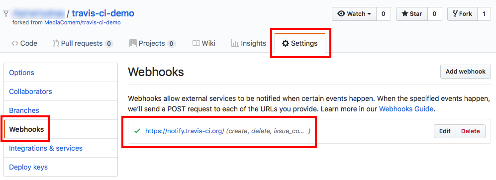

# Travis CI demo

This project is a very simple test suite intended to demonstrate use of the Travis CI continuous integration platform.
The `index.js` file contains a few functions and the `tests/unit.test.js` file contains a test suite for these functions.

<!-- START doctoc -->
<!-- END doctoc -->


## Requirements

* [Node.js][node] 10.x


## Usage


### Run the test suite locally

Fork this repository by clicking the **Fork** button at the top:


Clone the forked repository to your local machine
(replacing `JohnDoe` by your GitHub username):

```bash
$> cd /path/to/projects
$> git clone git@github.com:JohnDoe/travis-ci-demo.git
```

Go into the repository:

```bash
$> cd travis-ci-demo
```

Install dependencies:

```bash
$> npm ci
```

Make sure the test suite works:

```bash
$> npm test

  add
    ✓ should add two numbers

  subtract
    ✓ should subtract two numbers

  compute
    ✓ should apply the specified operation to two numbers

  3 passing (10ms)
```


### Enable your repository on Travis CI

Log in to [Travis CI][travis-ci] with your GitHub account
and authorize the requested permissions if asked.

Go to [your repositories][travis-ci-repos] and enable automated builds for your Travis CI demo repository.

> Press the "Sync account" button if you do not see the repository in the list.

Travis CI should have added a webhook to your GitHub repository.
Make sure it is configured in your GitHub repository's settings:



> This means that when you push to the repository,
> GitHub will notify Travis CI that new commits are available,
> and Travis CI will trigger an automated build.

### Make sure you follow the Travis CI conventions

The [Travis CI Tutorial][travis-ci-tutorial] explains how to get started.
In a nutshell, your project should have a `.travis.yml` file at the root which describes what language it is so that Travis CI knows how to build it.

> Take a look at [this project's `.travis.yml` file](.travis.yml).

For [Node.js projects][node], Travis CI will do the following by default:

* Install your dependencies with `npm ci`.
* Run your tests with `npm test`.

> Take a look at [this project's `package.json` file](package.json)
> and note that a `test` script is configured to run the project's automated tests with [Mocha][mocha].


### Commit and push a change to trigger an automated build

Make and commit any change:

```bash
$> echo >> change
$> git add change
$> git commit -m "Change"
```

Push your changes to GitHub:

```bash
$> git push origin master
```

GitHub should trigger the webhook and notify Travis CI.
If you go to the main [Travis CI page][travis-ci],
you should see an automated build appear for your repository.

> If you do not see your build appear,
> go to https://travis-ci.org/JohnDoe/travis-ci-demo
> (replacing `JohnDoe` with your GitHub username).

As soon as a Travis CI virtual machine is available,
your automated build should execute, run your test suite, and complete successfully.


[mocha]: https://mochajs.org
[node]: https://nodejs.org
[travis-ci]: https://travis-ci.org
[travis-ci-node]: https://docs.travis-ci.com/user/languages/javascript-with-nodejs/
[tracis-ci-repos]: https://travis-ci.org/account/repositories
[travis-ci-tutorial]: https://docs.travis-ci.com/user/tutorial/
